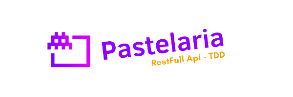

# Pastelaria - RESTFull API TDD

<p align="center">
    
</p>

## Index

- [About Repository](#about-repository)
- [Tech Specification](#tech-specification)
- [Features](#features)
- [Installation](#installation)
- [Install with Docker](#install-with-docker)
- [Unit Test](#unit-test)
    - [run PHPUnit in local](#run-phpunit-in-local)
    - [run PHPUnit in SAIL (Docker)](#run-phpunit-in-sail-docker)
- [API usage](#api-usage)
    - [API Endpoints](#api-endpoints)
- [License](#license)


## About Repository<a name="about-repository"></a>

This repository is a project of a API RESTful with Laravel 8. 
The project is a CRUD of Clients, Products and Orders. 
The project is using TDD (Test Driven Development) with PHPUnit.

## Tech Specification <a name="tech-specification"></a>

- PHP 8.1
- Laravel 10
- MySQL 8
- Docker with Laravel Sail
- PHPUnit 10 (Test Case/Test Coverage)

## Features <a name="features"></a>

- Clientes:
  - POST, PUT, PATCH, GET List with Pagination, GET with id, Delete
- Produtos:
  - POST, PUT, PATCH, GET List with Pagination, GET with id, Delete
- Pedidos:
  - POST, PUT, PATCH, GET List with Pagination, GET with id, Delete, GET Pedidos Produtos, GET Pedidos Clientes
- Build with Docker

## Installation <a name="installation"></a>

- `git clone https://github.com/NeuronioAzul/api-tdd.git`
- `cd api_tdd/`
- `composer install`
- `cp .env.example .env`
- Update `.env` and set your database credentials
- `php artisan key:generate`
- `php artisan migrate`
- `php artisan db:seed`
- `php artisan serve`

## Install with Docker <a name="install-with-docker"></a>

- `docker-compose up -d`
- `docker exec -it api-tdd /bin/bash`
- `composer install`
- `cp .env.example .env`
- `php artisan key:generate`
- `php artisan migrate`
- `php artisan db:seed`
- Application http://localhost/
- Adminer for Database http://localhost:8080/
  - DBhost: 
    - server:mysql
    - user: sail
    - Password: password
    - DataBase: api_tdd

## Unit Test <a name="unit-test"></a>

#### run PHPUnit in local <a name="run-phpunit-in-local"></a>

```bash
# run PHPUnit all test cases
vendor/bin/phpunit
# Feature test only
vendor/bin/phpunit --testsuite Feature
# Unit test only
vendor/bin/phpunit --testsuite Unit
```

#### run PHPUnit in SAIL (Docker) <a name="run-phpunit-in-sail-docker"></a>
```bash
# run PHPUnit all test cases
sail artisan test
# Unit test only
sail artisan test --testsuite Feature
# Feature test only
sail artisan test --testsuite Unit
```

#### Code Coverage Report <a name="code-coverage-report"></a>

```bash
# reports is a directory name
vendor/bin/phpunit --coverage-html reports/
```
A `reports` directory has been created for code coverage report. Open the dashboard.html.

## API usage <a name="api-usage"></a>

### Postman Collection <a name="postman-collection"></a>

Access: [API TDD - Postman Collection](https://www.postman.com/pastelaria-api-restfull-tdd/workspace/pastelaria)

### Postman Documentation <a name="postman-documentation"></a>

Access: [API TDD - Postman Documentation](https://documenter.getpostman.com/view/5349883/2s93sdYC8z)

### API Endpoints <a name="api-endpoints"></a>

- Clientes:
  - POST
    - /api/v1/clientes
  - PUT
    - /api/v1/clientes/<id>
  - PATCH
    - /api/v1/clientes/<id>
  - GET List with Pagination
    - /api/v1/clientes
  - GET one
    - /api/v1/clientes/<id>
  - Delete
    - /api/v1/clientes/<id>
- Produtos:
  - POST
    - /api/v1/produtos
  - PUT
    - /api/v1/produtos/<id>
  - PATCH
    - /api/v1/produtos/<id>
  - GET List with Pagination
    - /api/v1/produtos
  - GET with id
    - /api/v1/produtos/<id>
  - Delete
    - /api/v1/produtos/<id>
- Pedidos:
  - POST
    - /api/v1/pedidos
  - PUT
    - /api/v1/pedidos/<id>
  - PATCH
    - /api/v1/pedidos/<id>
  - GET List with Pagination
    - /api/v1/pedidos
  - GET with id
    - /api/v1/pedidos/<id>
  - Delete
    - /api/v1/pedidos/<id>
  - GET Pedidos Produtos
    - /api/v1/pedidos/<id>/produtos
  - GET Pedidos Clientes
    - /api/v1/pedidos/<id>/clientes


## License <a name="license"></a>

Projeto sendo disponibilizado sobre a licença [MIT license](https://opensource.org/licenses/MIT).

A framework do Laravel é programa open-sourced licenciado sobre a [MIT license](https://opensource.org/licenses/MIT).
